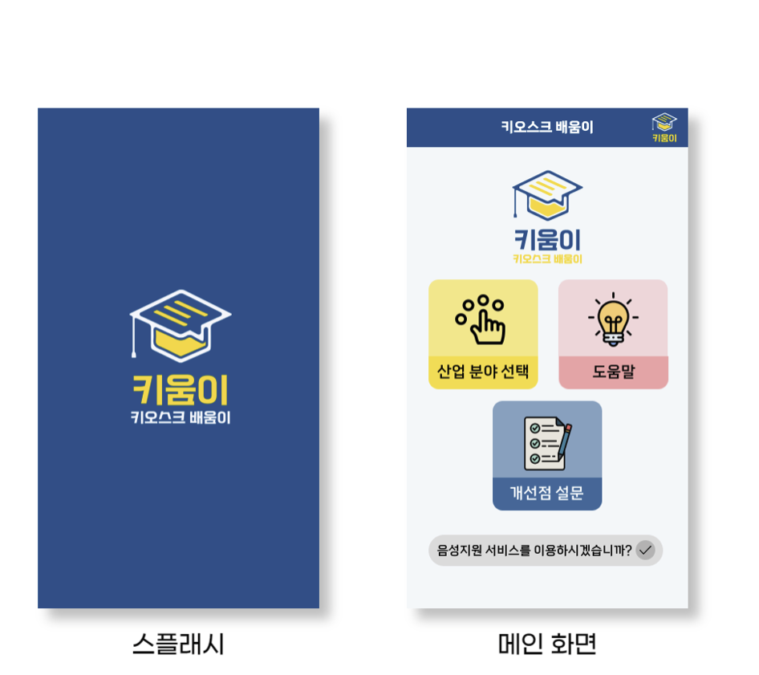
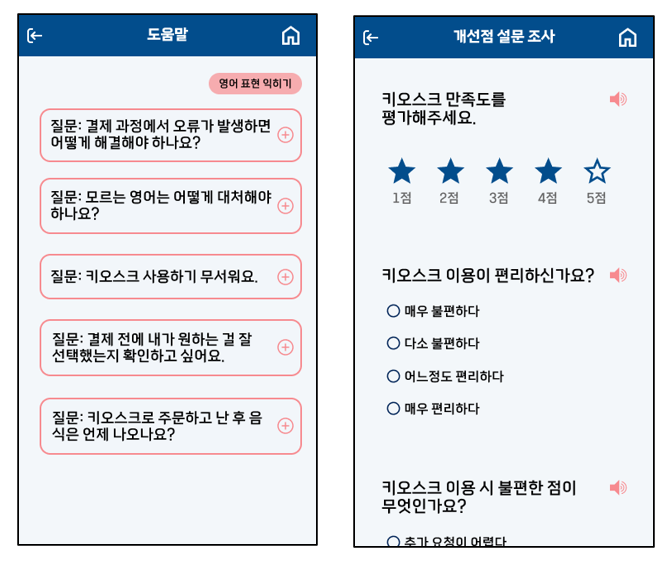
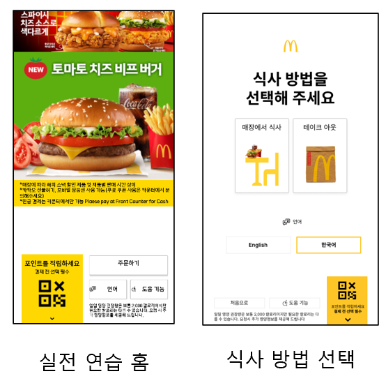

# 2024 Corner  정규 프로젝트

<p align="center">


# Kiumi 키움이

> **덕성여자대학교 개발 소모임 _'코너'_ 팀 '에스티(ST)'**  
>
> ⚡ **키오스크의 빠른 확산**  
> 어느덧 현대 생활 속 필수 요소로 자리 잡은 키오스크.  
> 하지만 **매장마다 전혀 다른 UI/UX**를 제공해 많은 사용자가 **혼란**을 느끼고 있습니다.
>
> 💡 **해결책**  
> 저희는 사용자가 다양한 업체의 키오스크 **인터페이스를 미리 경험**할 수 있는 **서비스**를 제공합니다.
>
> 📅 **개발 기간**  
> 2024년 3월부터 2024년 10월까지

<br/>

## 배포 주소

> **개발 버전** : [https://www.duksung.ac.kr/main.do](https://www.duksung.ac.kr/main.do) <br>
> **프론트 서버** : [https://www.duksung.ac.kr/main.do](https://www.duksung.ac.kr/main.do) <br>
> **백엔드 서버** : [https://www.duksung.ac.kr/main.do](https://www.duksung.ac.kr/main.do) <br>

<br/>

## 팀 소개

|       박유정       |       김다빈        |      조소윤        |       정지민       |                                                                                                               
| :-----------------: | :-----------------: | :----------------: | :----------------: | 
|  |  |  |  |
| 프론트엔드 | 프론트엔드 | 프론트엔드<br>백엔드 | 프론트엔드<br>백엔드 | 
| [@qkrdbwjd](https://github.com/qkrdbwjd) | [@dalpaeng6](https://github.com/dalpaeng6) | [@soyoon1](https://github.com/soyoon1) | [@sunflwwer](https://github.com/sunflwwer) |
| 덕성여자대학교 <br> 컴퓨터공학과 3학년 (휴학) | 덕성여자대학교 <br> 컴퓨터공학과 3학년 | 덕성여자대학교 <br> 컴퓨터공학과 3학년 (휴학) | 덕성여자대학교 <br> 컴퓨터공학과 3학년 |

<br/>

## 프로젝트 소개
**키움이(키오스크 배움이)는 사용자가 실제 키오스크와 유사한 인터페이스를 체험하고 학습할 수 있는 애플리케이션**입니다.
> 키오스크에 익숙치 않은 사용자의 경험을 개선하여 실제 키오스크 이용 시간을 단축할 수 있습니다.
> 디지털 소외계층이 보다 쉽게 애플리케이션을 이용할 수 있도록 비회원제를 지원합니다.
> 사용자의 트래킹 데이터, 개선점 설문 조사 결과, UI 개선안 vs 기존 UI 설문 조사 결과를 수집함으로써 수익 창출의 가능성과 애플리케이션의 확장성을 확보하였습니다.

<br/><br/><br/>

# 시작 가이드
### Requirements
For building and running the application you need:

- [MySQL 8.0](https://dev.mysql.com/downloads/mysql/) 
- [Android SDK](https://developer.android.com/studio)
- [Java Development Kit (JDK) 17](https://www.oracle.com/java/technologies/javase-jdk11-downloads.html)
- [Python 3.12.4](https://www.python.org/downloads/)

<br/>

### Installation and Running
#### Spring Boot Server (IntelliJ IDEA 사용)
1. 레포지토리 클론:
   ```bash
   $ git clone https://github.com/Kiumi-ST/back-end.git
   $ cd back-end
   ```
2. IntelliJ IDEA에서 열기:
   - IntelliJ IDEA를 실행합니다.
   - `Open`을 클릭하고 `back-end` 폴더의 `build.gradle` 파일을 선택합니다.
3. 애플리케이션 실행:
   - 프로젝트가 로드되면, 우측 상단에 있는 초록색 `Run` 버튼을 클릭하여 Spring Boot 서버를 시작합니다.

<br/>

#### Flask Server
1. 레포지토리 클론:
   ```bash
   $ git clone https://github.com/Kiumi-ST/back-end-flask.git
   $ cd back-end-flask
   ```
2. 가상 환경 설정:
   ```bash
   $ python -m venv venv 
   $ venv\Scripts\activate   # Windows 사용 시, Unix 계열은 `source venv/bin/activate`
   ```
3. 의존성 설치 및 실행:
   ```bash
   $ pip install -r requirements.txt
   $ flask --app app run --host=0.0.0.0 --port=8000
   ```

<br/>

#### Client (Android Studio 사용)
1. 레포지토리 클론:
   ```bash
   $ git clone https://github.com/Kiumi-ST/front-end.git
   $ cd front-end
   ```
2. Android Studio에서 열기:
   - Android Studio를 실행합니다.
   - `Open`을 선택하고 `front-end` 폴더를 엽니다.
3. 애플리케이션 실행:
   - 상단에 있는 초록색 `Run` 버튼을 클릭하여 에뮬레이터 또는 연결된 기기에서 Android 앱을 실행합니다.   

<br/><br/><br/>

# 주요 기능
#### 📲 키오스크 연습 기능
- 실전 연습: 패스트푸드 업체의 실제 키오스크와 유사한 화면 및 로직을 구현하여 UI/UX 조작 및 결제 시스템 연습 가능
- 순서 지침: 키오스크 사용에 익숙하지 않은 사용자가 키오스크 로직을 파악할 수 있도록 조작 유도
- 개선안 연습 및 기존안 vs 개선안 설문: 사용자에게 기존 키오스크보다 조작하기 쉬운 개선안 버전을 제공
#### 💡 도움말
- 결제 방식, 편의 사항 등 사용자가 느끼는 공통적인 어려움에 대하여 직관적인 설명 제공
- 키오스크에 자주 사용되는 영어 표현 뜻과 풀이 제공
#### 📝 개선점 설문
- 사용자의 키오스크 이용 불편 사항을 수집하여 데이터 축적
#### 🐾 사용자 반응 추적
- 화면별 체류 시간, 잘못 누르는 화면 이름, 얼굴 인식 등을 사용하여 사용자가 어디서 어떤 어려움을 겪고 있는지 수집
- 사용자 반응 추적을 바탕으로 실전 연습 및 개선안 연습 시 사용자가 어려움을 느낄 때 순서지침으로 넘어갈 수 있는 팝업을 제공

<br/>

# 스택
### Environment
- 개발 환경 : Android Studio, IntelliJ IDEA, Visual Studio Code
- OS : Windows
### Development
- 개발 도구 : Git, Spring Boot, Java SDK, MySQL, Flask
- 개발 언어 : Java, Kotlin, SQL, Python
- 기타사항 : Android SDK, Gradle, Google Cloud, Firebase, DeepFace, BigQuery
### Communication
- 형상관리 : GitHub
- 의사소통 관리 : Discord
- 협업 관리 : Notion, Google drive
- 협업 도구 : Figma, ERDCloud

<br/>

# 화면 구성




<br/>

# ✒️ API
- API 명세서 : [(https://www.notion.so/API-eaa0057161d443d0af90b464004572a4?pvs=21)](https://www.notion.so/API-eaa0057161d443d0af90b464004572a4)

<br/>

# 📝 아키텍쳐

